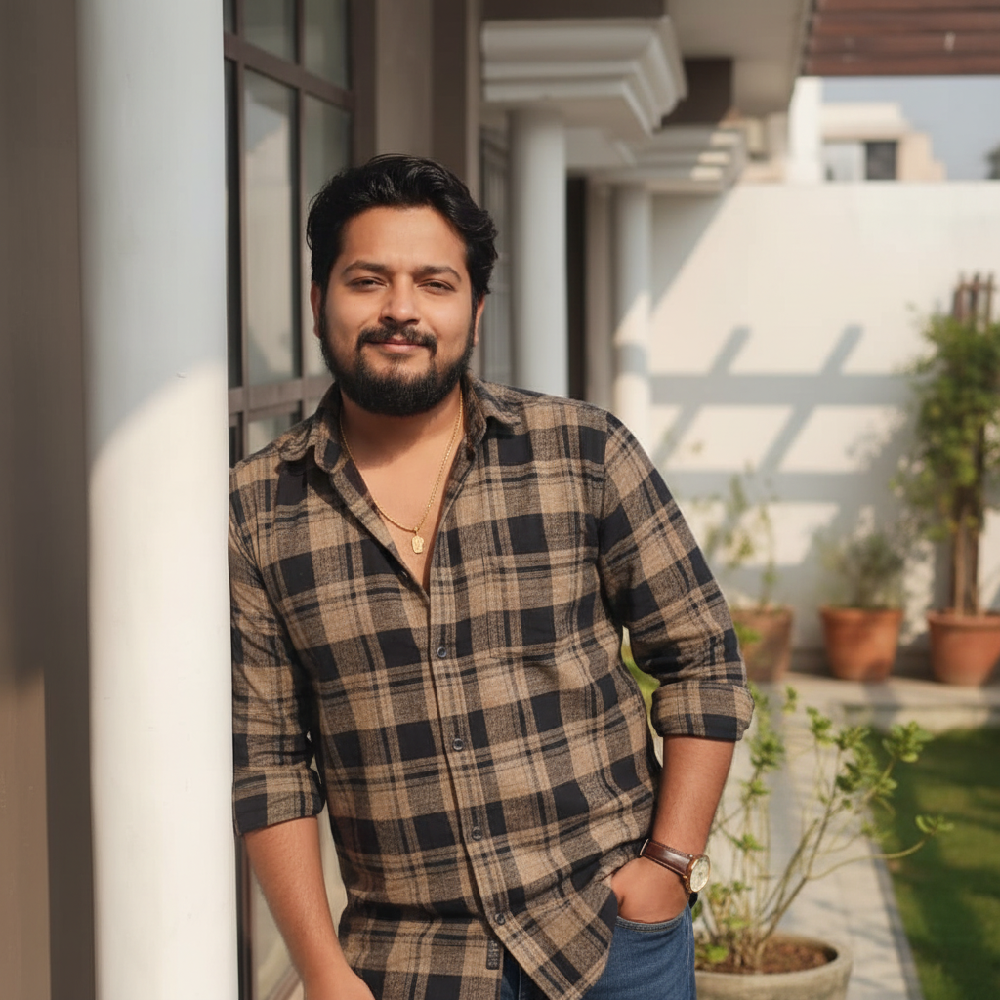

<div align="center">


<a href="https://cool-dango-ca326e.netlify.app/">
  
</a>

<br/>

[](https://git.io/typing-svg)

<br/>

[](https://cool-dango-ca326e.netlify.app/)
[](https://www.linkedin.com/in/rohit-kashyap73)
[](mailto:rohitkashyap3464@gmail.com)
[](https://github.com/rohitkashyap7398)

<br/>


</div>

---

## 🧑‍💻 About Me

```js
const rohit = {
  role      : "Full Stack Developer (MERN) + UI/UX Designer",
  location  : "Lucknow, India 🇮🇳",
  education : "B.Tech CSE @ Shrinathji Institute (2025)",
  working   : "Sheryians Pvt. Ltd. — Full Stack + AI Intern",
  skills    : ["React", "Next.js", "Node.js", "MongoDB", "Three.js", "GSAP", "Figma", "AI Tools"],
  passion   : ["Clean UI", "Cinematic Animations", "Scalable Apps", "AI"],
  stats     : { projects: "100+", experience: "2+ years", companies: 2, stacks: "6+" },
  funFact   : "Figma first, code second — design meets engineering 🎨"
};
```

<div align="center">

</div>

---

## ⚡ Tech Stack & Skills

<div align="center">

### 🖥️ Frontend


### 🎨 Design & Animation


### 🔧 Backend & Database


### 🤖 AI Tools I Use Daily


### 🛠️ Tools & Deployment


</div>

---

## 📈 Skills Proficiency

<div align="center">

### 🎨 Frontend & Design
| Skill | Level | Proficiency |
|-------|-------|-------------|
| ⚛️ React & Next.js | `Expert` |  |
| 🟨 JavaScript | `Expert` |  |
| 🎨 UI/UX & Figma | `Expert` |  |
| 💨 Tailwind CSS | `Expert` |  |

### ⚡ Animation & 3D
| Skill | Level | Proficiency |
|-------|-------|-------------|
| 🟢 GSAP | `Advanced` |  |
| 🔺 Three.js | `Advanced` |  |
| 🔵 Framer Motion | `Advanced` |  |

### 🔧 Backend & Database
| Skill | Level | Proficiency |
|-------|-------|-------------|
| 🟩 Node.js & Express | `Expert` |  |
| 🍃 MongoDB | `Expert` |  |
| 🐍 Python & Django | `Intermediate` |  |

### 🤖 AI & Tools
| Skill | Level | Proficiency |
|-------|-------|-------------|
| 🧠 AI Dev Tools | `Expert` |  |
| 🐙 Git & GitHub | `Expert` |  |

</div>

---

## 💼 Experience

<table>
<tr>
<td>

**🏢 Sheryians Pvt. Ltd.** `Sept 2024 – Present`
> Full Stack Developer + UI/UX Designer Intern
> Working with AI-powered tools to build 10× faster

</td>
<td>

**🏢 Digi{Coders} Technologies** `Jan 2024 – Dec 2024`
> Frontend Developer
> Built production-level projects across multiple stacks

</td>
</tr>
</table>

---

## 🎓 Education

| Degree | Institute | Year |
|--------|-----------|------|
| B.Tech — Computer Science | Shrinathji Institute For Technical Education | 2025 (Appearing) |
| Diploma — Computer Science | BTEUP Board Lucknow | 2024 (Pass) |
| B.Sc — General | Dr. Bhimrao Ambedkar, Agra University | 2022 (Pass) |
| Computer Course | NEXA Computer Institute | 2022 |

---

## 🐍 Contribution Snake


---

## 🌊 Contribution Graph


---

## 🎯 What I Offer

<div align="center">

| Service | Description |
|---------|-------------|
| 🌐 **Full Stack Web Dev** | End-to-end MERN apps — DB design to pixel-perfect frontend |
| 📱 **Mobile App Dev** | Cross-platform React Native apps for iOS & Android |
| 🎨 **UI/UX Design** | Wireframes, prototypes & design systems in Figma |
| 🤖 **AI-Powered Features** | GPT-4, DALL-E & OpenAI API integrations |
| ⚡ **Frontend & Animations** | Cinematic UIs with GSAP, Framer Motion & Three.js |
| 🔧 **API & Backend Dev** | Robust REST APIs, auth systems & payment integrations |

</div>

---

<div align="center">

### 📫 Let's Build Something Epic Together!

[](https://git.io/typing-svg)

<br/>

[](https://cool-dango-ca326e.netlify.app/)
[](mailto:rohitkashyap3464@gmail.com)
[](https://www.linkedin.com/in/rohit-kashyap73)

<br/>

> *"Design meets engineering — from Figma wireframes to deployed full-stack products, one fluid process."*

<br/>


</div>
